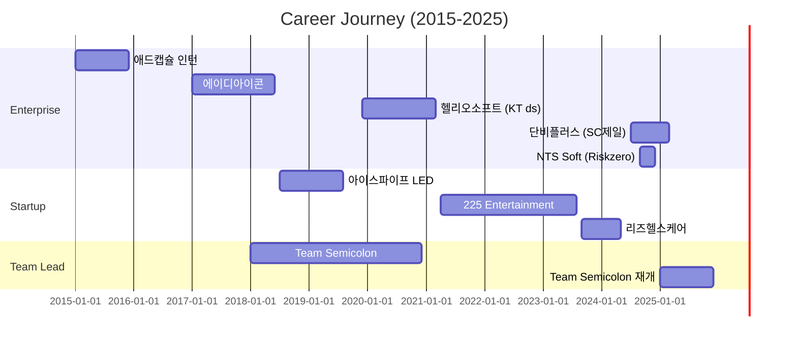

# 👋 Hi, I'm Jeon Junyeong (reus-jeon)

<div align="center">

[](https://git.io/typing-svg)

</div>

<div align="center">

[](https://www.notion.so/Jeon-jun-yeong-3d82376b4a034179abc3c01cd97a5197)
[](mailto:reus7042@gmail.com)
[](https://github.com/reus-jeon)

</div>

---

## 🎯 About Me

> **"서비스에 대한 깊은 이해를 바탕으로 문제를 해결하는 풀스택 개발자"**

- 💼 **8년차 경력**: 스타트업부터 대기업까지 다양한 환경 경험
- 🚀 **30+ 프로젝트**: 기획부터 배포까지 전체 라이프사이클 관리
- 👥 **팀 리더십**: Team Semicolon 대표, 3회 이상 팀 리드 경험
- 🛠️ **문제 해결**: 기술 스택을 가리지 않는 실용적 접근

---

## 💻 Tech Stack

### Frontend


### Backend


### Database & Cloud


### DevOps & Tools


---

## 🏆 Career Highlights

### 🏢 Enterprise Experience
- **NTS Soft** (2024.09 - 2024.12) - Riskzero 철도 안전관리 솔루션
- **단비플러스** (2024.07 - 2025.03) - SC제일은행 방문판매 솔루션 & 신분증 인식 개선
- **헬리오소프트** (2019.12 - 2021.03) - KT ds HelpIT & 챗봇 SM

### 🚀 Startup & Scale-up
- **리즈헬스케어** (2023.09 - 2024.05) - 팀 리더, 건강기능식품 커머스 플랫폼
- **225 Entertainment** (2021.04 - 2023.08) - 팀 리더, 스포츠 커뮤니티 & 마케팅 소프트웨어
- **아이스파이프 LED** (2018.07 - 2019.08) - B2B 조명거래 플랫폼

### 💼 Team Semicolon
**2018-2020**: 대표 & 리드 개발자로서 **30+ 프로젝트 수주 및 완수**
**2025-현재**: 커뮤니티 솔루션 개발 중심 팀 활동 재개

<details>
<summary>📌 주요 프로젝트 보기</summary>

#### 🎨 아트플랫 - NFT 마켓플레이스
- Ethereum 기반 NFT 커머스 서비스
- MetaMask 지갑 연동, Web3 통합

#### 🏪 빠샤 - 키오스크 결제 시스템
- React Native + Spring Boot
- 가상화폐 결제 시스템 구현
- 4개 서비스 연동 (키오스크, 사장님 어드민, 관리자 앱, 고객 앱)

#### 💄 꾸밍 - 뷰티 정보 앱
- React Native + Firebase
- 위치 기반 업체 검색 서비스

#### 📈 미래주식정보 - 주식 정보 앱
- 개인 맞춤 주식 추천 시스템
- iOS, Android 크로스 플랫폼

</details>

---

## 🎯 Current Focus (2025)

### 🔥 Active Projects

**Team Semicolon - 커뮤니티 솔루션 개발**
- Next.js + Supabase 기반 아키텍처
- GitHub Organization 기반 협업 환경 구축
- Epic-to-Tasks 자동화 워크플로우 시스템

---

## 📊 GitHub Stats

<div align="center">


<details>
<summary>📦 주요 Organization 프로젝트</summary>

#### 🏦 SC제일은행 프로젝트 (단비플러스)
- **기여도**: API 설계 95%, 서버 구축 70%, 어드민 100%
- **Tech**: Spring Boot, PostgreSQL, Kubernetes, Azure DevOps
- **성과**: 방문판매 솔루션 전체 아키텍처 설계 및 구현

#### 🚄 Riskzero 철도 안전관리 (NTS Soft)
- **기간**: 2024.09.18 - 2024.12.18
- **기여도**: Frontend 개발 주도
- **Tech**: React, TypeScript
- **성과**: 국가철도공단 산업안전 데이터 시각화 시스템 구축

#### 💊 리즈온 커머스 (리즈헬스케어)
- **기여도**: 전체 시스템 설계 및 팀 리딩
- **Tech**: Spring Boot, React, MySQL, AWS
- **성과**: 건강기능식품 커머스 플랫폼 0→1 구축

</details>

---

## 🌟 Key Strengths

```typescript
const developer = {
  name: "Jeon Junyeong",
  role: "Full Stack Problem Solver",
  experience: "8 years",

  strengths: {
    technical: [
      "인터랙티브 웹 개발 (NFT, 커머스, 커뮤니티)",
      "모바일 앱 개발 (React Native)",
      "OS 레벨 컨트롤 (Electron.js)",
      "전체 시스템 아키텍처 설계"
    ],
    business: [
      "프로젝트 수주 및 관리",
      "팀 빌딩 및 리더십",
      "문서화 및 커뮤니케이션",
      "애자일 프로세스 구축"
    ],
    mindset: [
      "문제 해결 중심 접근",
      "기술 스택에 구애받지 않음",
      "끝까지 책임지는 자세",
      "서비스 이해 기반 개발"
    ]
  },

  philosophy: "스스로를 프론트엔드 또는 백엔드로 한정하지 않습니다. " +
              "주어진 문제를 해결하는 소프트웨어 엔지니어이자 문제 해결사입니다."
};
```

---

## 📈 Experience Timeline



---

## 🎓 Education & Achievements

- 🎓 **명지전문대 컴퓨터공학과** (2011-2016)
- 🏅 **GitHub Achievements**:
  - Arctic Code Vault Contributor
  - Pull Shark x3
  - Pair Extraordinaire
  - Quickdraw
  - YOLO

---

## 📫 Contact Me

<div align="center">

[](https://www.notion.so/Jeon-jun-yeong-3d82376b4a034179abc3c01cd97a5197)
[](mailto:reus7042@gmail.com)
[](mailto:reus@semi-colon.space)
[](tel:010-5789-7335)

</div>

---

<div align="center">

### 💬 Philosophy

**"Team Semicolon의 의미처럼, 어떤 프로젝트를 진행하든**
**무슨 일이 중간에 생기든 책임감을 갖고 끝까지 마무리합니다."**


</div>
